# The Great Riau: Math-Biz Mania

The Great Riau: Math-Biz Mania adalah permainan edukasi berbasis web yang menggabungkan konsep matematika, kewirausahaan, dan budaya Melayu Riau dalam sebuah pengalaman belajar yang interaktif. Pemain akan membangun usaha virtual mulai dari perencanaan bisnis, produksi, hingga penjualan produk sambil menyelesaikan berbagai tantangan matematika yang terintegrasi ke dalam mekanisme permainan.

## Features

* Simulasi bisnis interaktif berbasis cerita
* Sistem XP dan progres pemain
* Manajemen budget dan sumber daya
* Sistem perekrutan karyawan dengan inflasi biaya
* Solver program linear untuk optimasi keuntungan
* Generasi soal pertidaksamaan secara dinamis
* Visualisasi grafik menggunakan SVG native
* Penyimpanan progres otomatis menggunakan Local Storage
* Desain antarmuka bernuansa budaya Melayu Riau

## Technology Stack

### Frontend

* React 19
* Vite
* React Router DOM v6

### Styling

* Tailwind CSS v4

### State Management

* React Context API
* Local Storage

### Deployment

* Vercel

## Architecture

Saat ini aplikasi dibangun sepenuhnya sebagai Single Page Application (SPA) tanpa backend maupun database eksternal.

Seluruh data permainan seperti:

* XP pemain
* Budget usaha
* Riwayat permainan
* Progress produk
* Status karyawan

disimpan secara lokal menggunakan kombinasi React Context API dan Local Storage. Pendekatan ini dipilih untuk menjaga arsitektur tetap sederhana, ringan, dan mudah digunakan tanpa memerlukan proses autentikasi maupun konfigurasi server.

## Future Development

Pengembangan selanjutnya akan berfokus pada transformasi aplikasi dari sistem penyimpanan lokal menjadi arsitektur berbasis backend dan database. Dengan pendekatan tersebut, data pemain dapat disimpan secara terpusat dan sinkron di berbagai perangkat.

Rencana pengembangan meliputi:

* Implementasi backend API untuk pengelolaan data permainan.
* Integrasi database untuk penyimpanan data yang lebih aman dan skalabel.
* Sistem akun dan autentikasi pengguna.
* Sinkronisasi progres permainan lintas perangkat.
* Penyimpanan riwayat permainan secara permanen.
* Leaderboard dan sistem peringkat pemain.
* Dashboard analitik untuk memantau perkembangan pemain.
* Dukungan fitur multiplayer dan kolaborasi di masa mendatang.

Pengembangan ini bertujuan meningkatkan fleksibilitas, skalabilitas, dan pengalaman pengguna sehingga The Great Riau: Math-Biz Mania dapat berkembang dari proyek edukasi berbasis frontend menjadi platform pembelajaran interaktif yang lebih komprehensif.

## Educational Components

Permainan ini mengintegrasikan berbagai konsep matematika ke dalam gameplay, di antaranya:

* Sistem pertidaksamaan linear
* Program linear
* Analisis titik optimum
* Perhitungan biaya produksi
* Perhitungan keuntungan
* Pengelolaan sumber daya usaha

Tujuannya adalah membantu siswa memahami penerapan matematika dalam konteks bisnis dan pengambilan keputusan.

## Live Demo

The Great Riau: Math-Biz Mania telah berhasil di-deploy menggunakan Vercel dan dapat diakses secara publik melalui:

**Demo Website:**
[The Great Riau: Math-Biz Mania Live Demo](https://great-riau-mathbiz.vercel.app/?utm_source=chatgpt.com)

Setiap perubahan yang di-push ke branch utama repository akan secara otomatis memicu proses build dan deployment melalui integrasi GitHub–Vercel, sehingga versi publik aplikasi selalu selaras dengan perkembangan terbaru proyek.

## Deployment

Aplikasi di-deploy menggunakan Vercel dengan workflow Continuous Deployment (CD).

### Deployment Pipeline

1. Developer melakukan push ke repository GitHub.
2. Vercel mendeteksi perubahan secara otomatis.
3. Proses build dijalankan menggunakan Vite.
4. Jika build berhasil, versi terbaru langsung dipublikasikan.
5. Pengguna dapat mengakses pembaruan melalui URL publik tanpa konfigurasi tambahan.

Pendekatan ini memungkinkan proses pengembangan yang cepat, konsisten, dan mudah dipelihara selama siklus hidup proyek berlangsung.

## Installation

Clone repository:

```bash
git clone https://github.com/fidiakacoderlearner/great-riau-mathbiz.git
```

Masuk ke direktori proyek:

```bash
cd great-riau-mathbiz
```

Install dependencies:

```bash
npm install
```

Jalankan development server:

```bash
npm run dev
```

Build untuk production:

```bash
npm run build
```

## Contributing

Kontribusi sangat terbuka untuk pengembangan fitur, perbaikan bug, peningkatan dokumentasi, dan penyempurnaan pengalaman belajar dalam permainan.

1. Fork repository
2. Buat branch baru
3. Commit perubahan
4. Push ke branch
5. Buat Pull Request

## Roadmap

* Multiplayer mode
* Leaderboard pemain
* Sistem achievement
* Konten matematika yang lebih beragam
* Dukungan perangkat mobile yang lebih luas
* Analitik pembelajaran pemain

## License

MIT License

## Maintainer

Afdhal Fidi Ansori

GitHub: https://github.com/fidiakacoderlearner

## Screenshots

### Landing Page

Halaman awal yang memperkenalkan pemain pada dunia The Great Riau: Math-Biz Mania dan memberikan gambaran mengenai konsep permainan berbasis matematika, bisnis, dan budaya Melayu Riau.

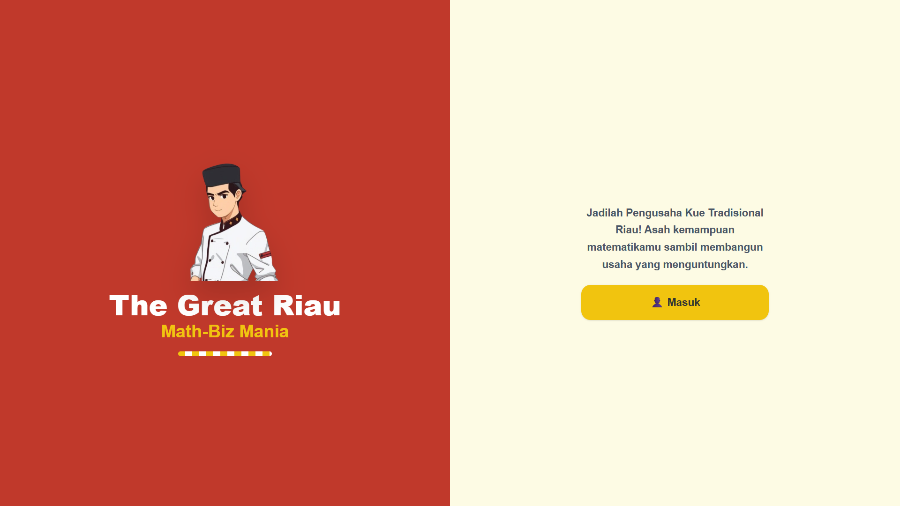

---

### Login Page

Halaman autentikasi yang digunakan pemain untuk memulai perjalanan dan mengakses fitur permainan.

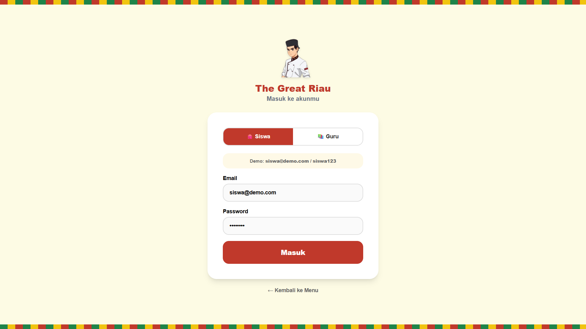

---

### Home Page

Pusat navigasi utama yang menampilkan informasi progres pemain, XP, budget, dan akses ke berbagai aktivitas permainan.

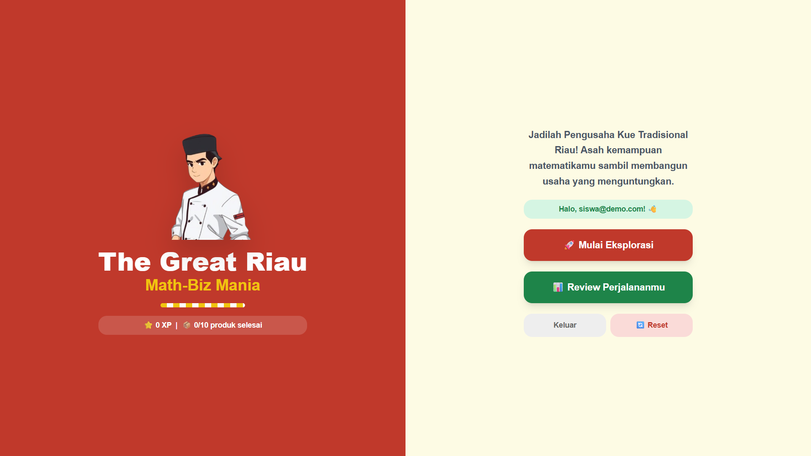

---

### Employee Selection

Halaman untuk merekrut dan mengelola karyawan yang akan membantu proses produksi usaha pemain.

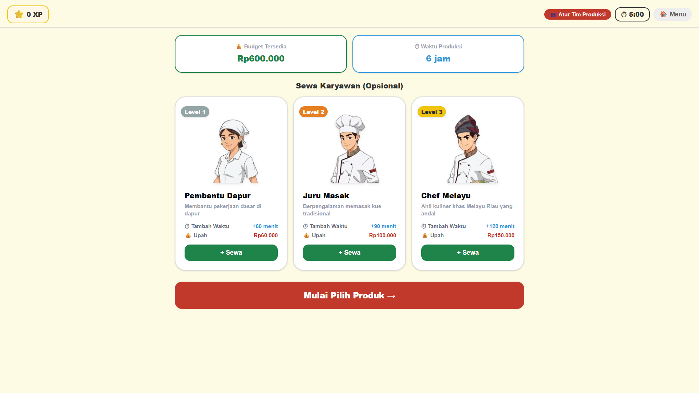

---

### Initial Capital Selection

Halaman pemilihan modal awal yang akan digunakan untuk memulai usaha dan menentukan strategi bisnis pemain.

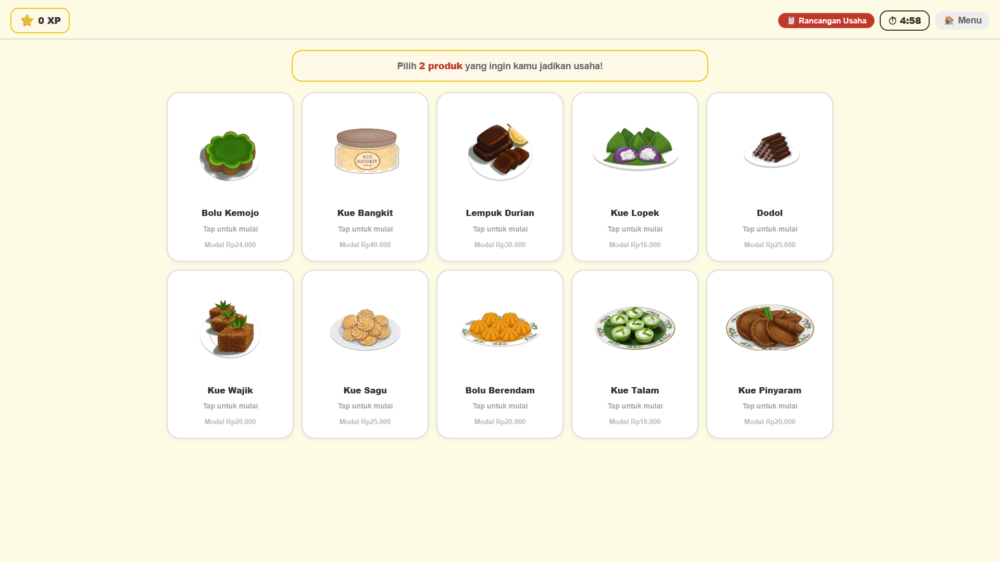

---

### Capital Planning Challenge

Tantangan matematika yang mengharuskan pemain menentukan keputusan modal usaha berdasarkan perhitungan yang diberikan.

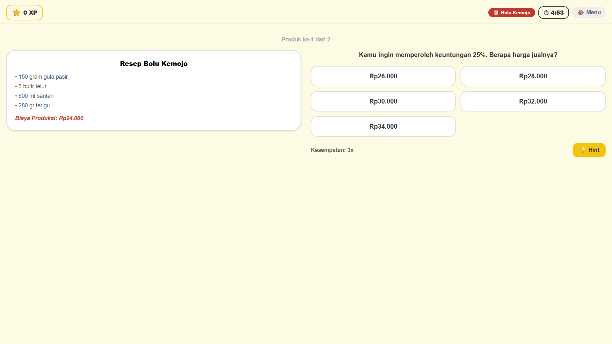

---

### Production Challenge

Tantangan produksi yang mengintegrasikan konsep matematika dan pengambilan keputusan bisnis dalam proses pembuatan produk.

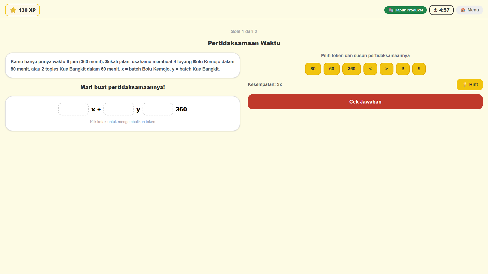

---

### Production Result

Halaman hasil produksi yang menampilkan performa proses produksi dan pencapaian pemain.

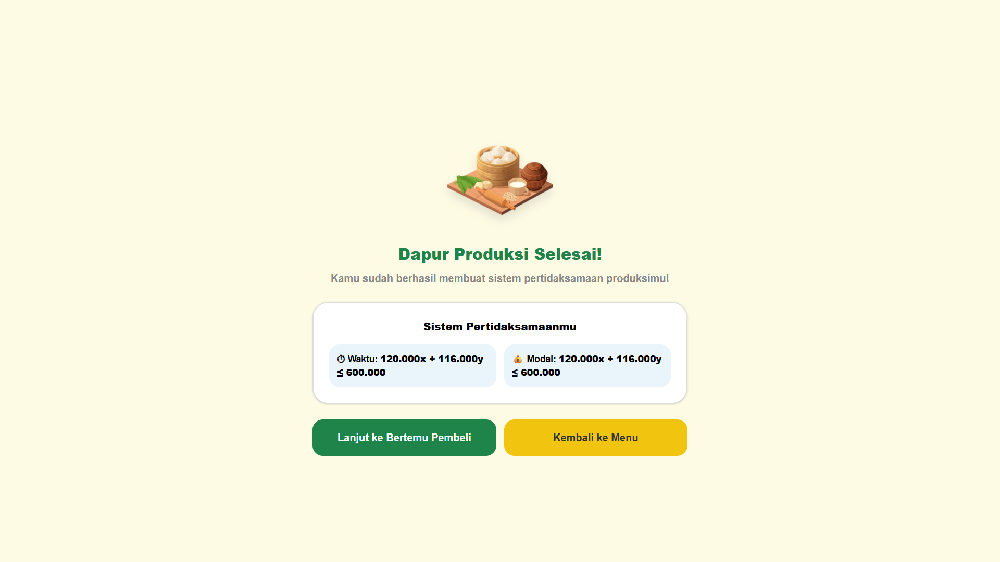

---

### Batch Management

Fitur pengaturan batch produksi untuk mengoptimalkan penggunaan sumber daya dan keuntungan usaha.

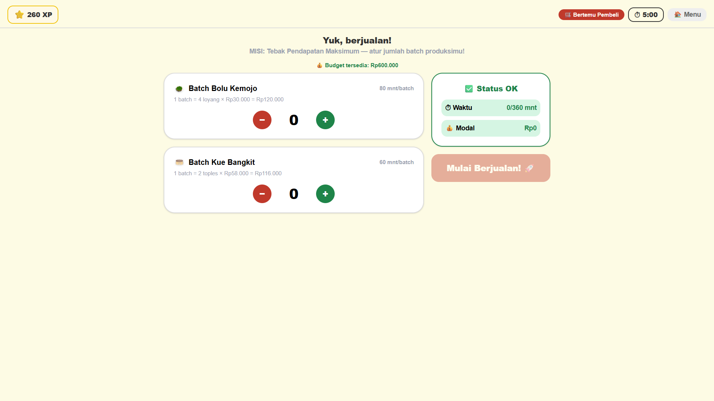

---

### Customer Interaction Result

Halaman hasil interaksi dengan pembeli yang menunjukkan keberhasilan strategi bisnis yang diterapkan pemain.

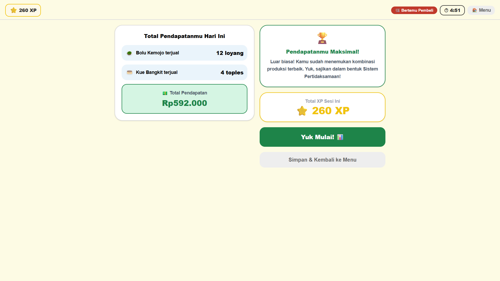

---

### Mathematical Visualization

Visualisasi grafik dan sistem pertidaksamaan menggunakan SVG native untuk membantu pemain memahami konsep matematika secara interaktif.

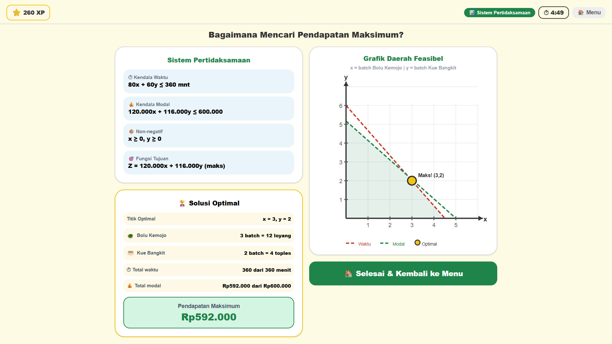

---

### Review & Analytics

Halaman evaluasi yang menyajikan statistik permainan, performa usaha, dan perkembangan pemain selama satu sesi permainan.

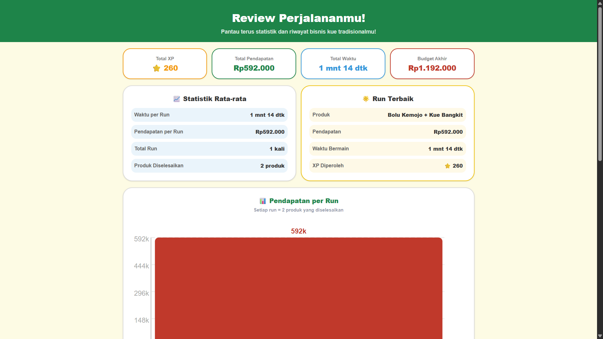
